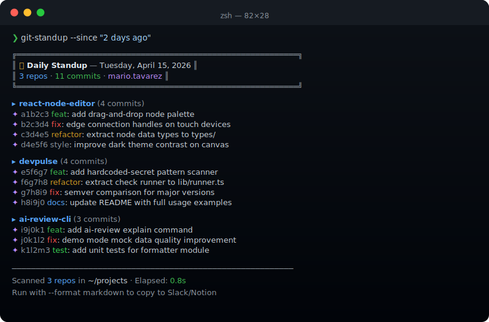

# git-standup

> **One command. Everything you shipped yesterday.**

`npx git-standup` scans all your local git repositories and shows every commit you made — grouped by repo, colored for readability. No setup, no config files, no external dependencies.

<p align="center">
  
</p>

---

## Quick start

```bash
npx git-standup
```

That's it. It auto-detects your git email and searches `~/` for all repos up to 3 levels deep.

---

## Example output

```
Searching for git repos in ~/...
Found 12 repos. Scanning commits since "yesterday" by mario@example.com...

~/projects/invoice-gen     (3 commits)
  a1b2c3d  10:42  feat: add PDF export route
  d4e5f6a  09:15  fix: line items total calculation
  b7c8d9e  08:50  chore: update dependencies

~/projects/api-server      (1 commit)
  f1a2b3c  11:30  fix: rate limiting middleware not applying

~/projects/dashboard       (2 commits)
  c4d5e6f  14:22  feat: add dark mode toggle
  e7f8a9b  13:10  refactor: extract chart components

6 commits across 3 repositories
```

---

## Flags

| Flag | Default | Description |
|------|---------|-------------|
| `--since=<value>` | `yesterday` | Time range. Accepts `yesterday`, `1week`, `3days`, `2024-01-15` |
| `--author=<email>` | `git config user.email` | Filter commits by author email |
| `--dir=<path>` | `~/` | Root directory to search for repos |
| `--depth=<n>` | `3` | How many directory levels deep to search |
| `--format=markdown` | — | Output Markdown for pasting into Slack or Notion |
| `--help`, `-h` | — | Show help |

### Examples

```bash
# Default: yesterday's commits across ~/
npx git-standup

# Last week
npx git-standup --since=1week

# Specific date
npx git-standup --since=2024-06-01

# Only search a specific folder, 2 levels deep
npx git-standup --dir=~/projects --depth=2

# Override author (useful on shared machines)
npx git-standup --author=mario@example.com

# Markdown output for Slack standup posts
npx git-standup --format=markdown
```

---

## Markdown output (for Slack / Notion)

```bash
npx git-standup --format=markdown
```

Produces:

```markdown
## Standup — Wednesday, April 16, 2026

**What I did:**

**`~/projects/invoice-gen`**
- `a1b2c3d` 10:42  feat: add PDF export route
- `d4e5f6a` 09:15  fix: line items total calculation
- `b7c8d9e` 08:50  chore: update dependencies

**`~/projects/api-server`**
- `f1a2b3c` 11:30  fix: rate limiting middleware not applying

> 4 commits across 2 repositories
```

Paste directly into your Slack standup thread or Notion daily note.

---

## Shell alias tip

Add this to your `~/.zshrc` or `~/.bashrc`:

```bash
alias standup="npx git-standup"
```

Then just run:

```bash
standup
standup --since=1week
standup --format=markdown
```

---

## How it works

1. **Finds repos** — walks the directory tree from `~/` (or `--dir`) up to `--depth` levels, detecting `.git` folders
2. **Queries git** — runs `git log` with `--since`, `--author`, and `--no-merges` in each repo
3. **Groups output** — repos with no matching commits are silently skipped
4. **Prints results** — colored terminal output or clean Markdown

Zero runtime dependencies. Pure Node.js built-ins: `child_process`, `fs`, `path`, `os`.

---

## Requirements

- Node.js 20+
- Git installed and on `PATH`

---

## License

MIT © [mariotavarez](https://github.com/mariotavarez)
